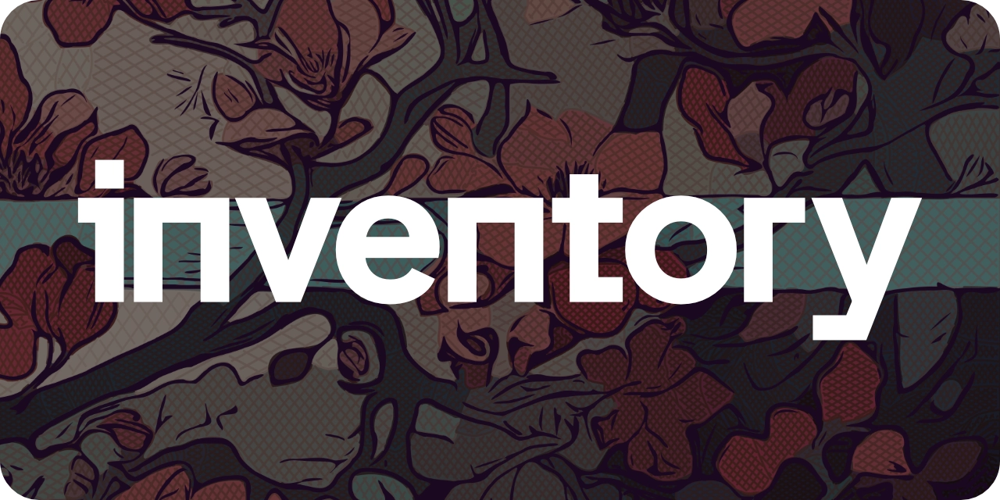

# inventory

A collection of tools to get things done

## Database

- [dbml](https://github.com/holistics/dbml) - Database Markup Language, designed to define and document database structures

## Diagramming

- [D2](https://github.com/terrastruct/d2) - diagram scripting language that turns text to diagrams ([playground](https://play.d2lang.com))
- [mermaid](https://github.com/mermaid-js/mermaid) - generate diagrams from markdown-like text ([playground](https://mermaid.live))
- [Markwhen](https://github.com/mark-when/markwhen) - make a cascading timeline from markdown-like text ([playground](https://markwhen.com/))

## License

[MIT](./LICENSE.md)
